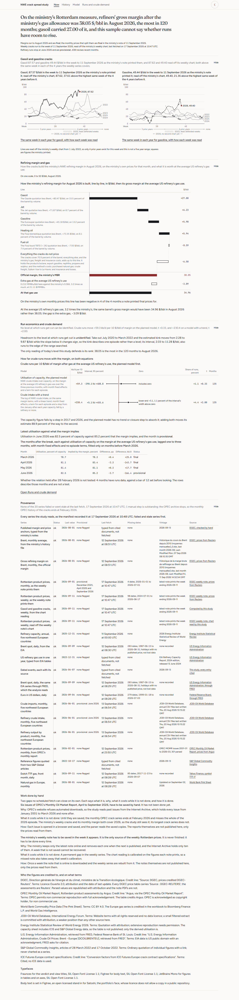

# NWE crack spread study

> **Crack spread study:** tracked NWE refining margins across gasoil and
> gasoline cracks, and linked run economics to crude demand.

That sentence is a claim, and this repository is the working behind it. Open the
site, disagree with the gas intensity, change it, and watch the margin after gas
and the headroom move.

**Live site:** https://nathancouturier.github.io/crack-spread-study/

---

## What the study cannot do

This section is first on purpose. If you only read one part of this file, read
this one.

- **It does not forecast a price, and it is not a trading strategy.** No entries,
  no exits, no position sizing, no signal, and **no Sharpe ratio anywhere in this
  repository**. There is no simulated profit and loss, because there is no
  simulated trade. SPEC.md section 6.6 forbids presenting it as one and nothing
  here does.
- **It could not find the level at which runs get cut.** The whole point of the
  run economics layer is a threshold in dollars, and the grid search did not
  produce one that survives its own robustness check. Take out July 2020 to March
  2022 and the estimated kink moves from 2.28 to 9.87 $/bbl while the slope below
  it changes sign, and the bootstrap interval, 2.03 to 11.28 $/bbl, runs to the
  edge of the range searched. So the site shows the word **unidentified** where a
  headroom figure would sit, and falls back to the ten year rank. It is not
  tuned until a threshold appears.
- **Its central horse race is underpowered, and that is the finding.** The
  question SPEC.md section 6.3 asks is whether the margin after gas explains
  refinery runs better than the raw gasoil crack. The answer this sample can give
  is: it cannot tell. None of the six comparisons of forecast errors is
  distinguishable from zero, and against the gaps they found those tests have
  power of 0.050 to 0.121, where a test's size of 0.05 is the rate at which it
  reports a difference that does not exist. Reaching 95 percent power would take
  between 1,570 and 670,408 monthly forecasts, against the 72 this sample has.
  **That is not a finding that the three measures are equal.** It is a finding
  that 72 monthly forecasts, every one of them in or after the pandemic, cannot
  separate them.
- **The weekly price layer is a reconstruction, not a publication.** The ministry
  deletes each weekly note when the next appears, so its printed tables amount to
  20 weeks in the whole preserved corpus. The 221 week weekly series is decoded
  from the vector polylines of the charts in those notes, calibrated against the
  printed figures on the same page. Measured error, out of sample by leave one
  series out: 0.17 to 0.44 $/t, about 0.02 to 0.06 $/bbl on the gasoil crack. It
  is labelled a reconstruction everywhere it appears, its error travels in the
  data, and 7 of its 221 weeks have no independent cross check at all. Six of
  those seven are the weeks of 1 July to 5 August 2022, and they are the least
  defended data in the study: read from one chart, so nothing can contradict
  them, and at the far left of that chart, 105 weeks from its nearest
  calibration anchor, which is where a smooth bend in a chart anchored at its
  right hand end does most harm. The seventh is the newest week, 18 September
  2026, which is uncorroborated but sits on the anchored end. The data says so
  itself, in `evidence_class`, and every chart that draws the six hatches them.
- **The gasoline leg does not reconcile with the contract factor.** OPEC's
  Rotterdam premium unleaded and the ministry's Eurosuper imply 6.94 to 8.33
  barrels per tonne, mean 7.72, over the 44 months where both exist, against the
  ICE contract's 8.33. The contract factor is kept and the gap is published. The
  two sources quote different grades, so the gap mixes a density with an octane
  spread, and choosing a factor to close it would be tuning.
- **Two gasoline rows are in dispute for 20 months and the study does not pick
  one.** Across 2010-05 to 2010-07 and 2012-02 to 2013-06, OPEC printed two
  different Rotterdam gasoline rows and there is no published document that
  settles which is the continuation of the other. Both are carried in the cache
  and both are drawn. Eight of those 20 months disagree in sign.
- **Carbon is out of scope.** EU ETS costs are not in the margin after gas. A
  European refiner pays them and this version does not price them. It is a
  limitation, not an oversight, and `other_variable_cost` is the field where a
  reader can put their own number.
- **The response is biased toward zero and the instrument could not fix it.**
  Runs move cracks, so the margin these equations treat as a cause is partly an
  effect of runs. The gas price was tried as an instrument; its first stage F is
  0.07 or 0.22 under each equation's own controls, far below the bar of 10,
  because the instrument's variation is the 2022 shock the episode terms remove.
  The two stage estimates are printed and not used. Read every coefficient as a
  **lower bound in absolute value**.
- **Whether the relation held after February 2026 is not tested.** Four months
  have runs data against a bar of twelve set before looking. The rows describing
  those months are on the page and are not a test.
- **The body face is not the portfolio's.** The portfolio sets Satoshi, whose ITF
  Free Font License forbids a copy in a public repository, and SPEC.md section
  0.1 forbids the CDN it is loaded from. Figtree is the openly licensed stand in.
  Every other token is the portfolio's, verbatim.

## What it does

It builds one number, in full view, and then lets you argue with every input to
it.

- **Two named, first class crack series.** Gasoil and gasoline against Brent, in
  $/bbl, monthly from October 2000 out of the OPEC Monthly Oil Market Report's
  Rotterdam table, and weekly from July 2022 out of the ministry's own weekly
  note. Each with its seasonal view and its contribution to the margin,
  distinguishable without colour by line style and a direct end label.
- **The official NWE margin, and this study's decomposition of it.** The French
  ministry's monthly gross refining margin on Brent is the headline series and is
  never overwritten. Beside it, the same barrel attributed to products as
  `yield * crack`, with the unattributable part on a visible residual line rather
  than spread silently across products.
- **The barrel the ministry assumes, against the barrel NWE refineries made.**
  The method's slate is fixed at 33.5 percent gasoil and 13.2 percent gasoline
  of every barrel. JODI's own output over the same countries' refinery intake,
  rolling over twelve months, runs 39.7 to 46.5 percent gasoil and 21.8 to 28.0
  percent gasoline. The History view weighs one set of cracks both ways and
  draws the two lines: re-weighting is worth +3.12 $/bbl on average and moves
  the level rather than the shape, correlation 0.996. Which barrel a yield is a
  share of is a real choice, so both JODI denominators are drawn and neither is
  picked.
- **Run economics.** The margin after gas, at the average US refinery's gas use
  of 0.212 MMBtu/bbl rather than the ministry's own 0.066, because the question
  is what a refiner who buys their energy earns. The wedge between the two ran
  0.23 to 10.24 $/bbl over the sample. Where a run cut level would sit, the site
  says unidentified and gives the ten year rank instead.
- **The link to crude demand, with its interval.** NWE refinery crude intake
  against the margin after gas at one to three months, Newey-West errors,
  reported in kb/d per 10 $/bbl on both the planned model and its fallback: 59.3
  kb/d on utilisation of capacity, interval minus 290.1 to 408.8, and 230.4 kb/d
  on crude intake with a trend, interval 5.1 to 455.6. Crude imports are shown
  beside intake as the physical footprint of the same demand.
- **A calculator that is the model, not a picture of it.** Every input editable,
  live recompute, the waterfall updating in place, breakevens in the units a desk
  quotes. `src/engine.js` and `src/crack/engine.py` are checked against each
  other on 200 randomised cases to 1e-9 in the gate, so the page cannot drift
  away from the pipeline.
- **Provenance for every number.** The manifest is a first class artifact and is
  rendered in full: every series, its source, its licence, when it was last
  fetched, its gaps, its vintage, its status, and the work this pipeline cannot
  do for itself.

---

## The site



More: [History](assets/history-desktop-light.png) with the 2022 range and the
event markers, the [Model](assets/model-desktop-light.png) calculator,
[Runs and crude demand](assets/runs-desktop-light-threshold.png) with the
hockey stick fit, and the same four at 375 px and in the dark theme, all in
[`assets/`](assets/).

---

## Running it locally

There is no build step, no framework, no bundler, no `npm install` and no CDN.
The site is plain HTML, vanilla ES2020 modules and CSS, reading JSON out of
`data/`. Node is needed only for the validators, and they have no dependencies
either.

```
git clone https://github.com/nathancouturier/crack-spread-study.git
cd crack-spread-study
python scripts/serve.py --port 8000
```

Then open **http://localhost:8000/crack-spread-study/**, with the subpath and the
trailing slash.

`scripts/serve.py` is standard library only, so that command works on a clean
clone with nothing installed. It mounts the repository at `/crack-spread-study/`
and answers 404 everywhere else, on purpose: the site is published at a project
subpath, SPEC.md section 0.1 calls a root relative path the most common way that
deployment breaks, and a plain `python -m http.server` from the repository root
cannot show it, because there `/styles/tokens.css` and `styles/tokens.css`
resolve to the same file.

To run the pipeline and the gate, install the Python dependencies once:

```
python -m pip install -e ".[dev]"
make gate
```

`make gate` runs eleven commands with no network and no browser. `make help`
lists every target.

| Command | What it does |
|---|---|
| `python scripts/refresh.py --offline` | Revalidates every committed cache against `data/manifest.json` and rewrites the manifest from what it measured. Opens no socket. |
| `python -m pytest tests` | The suite, about a thousand tests, including the unit conversions, the anchors of SPEC.md section 5.5 and the source adapters against committed fixtures. |
| `node tools/validate-data.mjs` | Re-measures the caches in JavaScript and compares with the manifest the Python wrote. Sixteen checks, none of which may skip. |
| `node tools/validate-engine.mjs` | Runs `src/engine.js` against 200 randomised cases emitted from `src/crack/engine.py` and fails on any line that disagrees by more than 1e-9. |
| `python scripts/export.py --check` | Rebuilds the ten site facing artifacts in memory, compares them byte for byte with what is committed, and checks the sha256 content hashes in `index.html`. |
| `node tools/validate-artifacts.mjs` | The artifacts against their schemas, and against each other. |
| `node tools/check-literals.mjs` | SPEC.md section 2 rule 2: no numeric literal in the frontend except unit constants. |
| `node tools/check-paths.mjs` | Every path relative, so the subpath deploy works. |
| `node tools/check-styles.mjs` | The stylesheets against the inherited design system. |
| `node tools/validate-format.mjs` | The frontend's pure modules under plain node, cross checked against `data/now.json`. |
| `node tools/check-dashes.mjs` | No em dash and no en dash in any tracked text file. |

Two more need a browser and a running server, so they are not in the gate:

```
python scripts/serve.py --port 8000        # in another shell
make layout                                # 19 rendered checks, 5 widths, both themes
make screenshots                           # whole page PNGs into assets/
```

Any Chromium works. `tools/browser.mjs` finds Edge, Chrome or Chromium in the
usual places, or takes `--browser <path>` or `CRACK_BROWSER`.

### It builds from a clean clone, and that is tested

Two caches in this project may not be redistributed and live in `data/private/`,
which is gitignored: the Energy Institute capacity table, and the Yahoo TTF
series. The DGEC weekly note PDFs are in there too. None of the three is in the
repository, so a fresh clone does not have them, and at Gate 5 that meant the
study could not be rebuilt by anybody but its author: 98 tests and
`python scripts/export.py --check` died on `FileNotFoundError`.

That is fixed, and the fix is tested the only way worth testing it. Clone the
repository to a temporary directory, delete `data/private`, and run the whole
gate there. What made it possible is committing the **derived** series the
analysis actually needs, while the raw tables stay private:

- `nwe5_refinery_capacity_annual`, the five country capacity total at each year
  end, one column, summed from the Energy Institute table. No per country row is
  published anywhere, and `tools/validate-data.mjs` check 16 fails the gate if
  one ever reaches a committed file.
- `dgec_note_decoded_index`, `_weekly`, `_printed` and `_monthly`, the decoded
  values per note per week per product. The PDFs stay private. A machine that has
  a PDF decodes it and checks it against its committed row, so the table is
  proved against the documents on every run rather than trusted.

---

## Refreshing the data

`make data` fetches. `make build` never does. The caches are committed so the
site and the results reproduce with no network, SPEC.md section 5.4.

**The weekly job runs this for you.** `.github/workflows/refresh.yml` runs at
07:10 UTC on Fridays: it collects the DGEC note first, refreshes the public
sources, rebuilds the artifacts, runs the whole gate, and commits only if every
validator passed. If anything fails it commits nothing and opens an issue.
`.github/workflows/build.yml` then runs the gate again from a clean checkout and
deploys to Pages.

### The weekly note duty, which is the one that cannot wait

The ministry publishes one "Note de conjoncture petroliere" at a time and
**deletes the previous one**. There is no archive on the ministry site and the
Internet Archive caught nine. A week that is not collected in its own week is
gone from the weekly series for good, at any price, ever.

```
make note        # two requests: the landing page, then the one pdf its href names
```

The scheduled job does this first, before every other source, and opens an issue
of its own if it fails, separately from everything else, because a missed note is
not one failure among several. **If that issue appears, act on it that week.**
Collecting a note also restitches the weeks already published, which is the
method working: the median across notes moves on every week the new note also
covers, and the count of weeks with no cross check usually falls.

### The six OPEC issues nobody can fetch

`opec.org` answers HTTP 403 to every scripted request, so the adapter resolves
issues through the Wayback Machine instead. The archive holds every Monthly Oil
Market Report from January 2001 to March 2026 and stops there. **Six issues,
April to September 2026, are in neither place**, which is why the headline
monthly crack series ends at 2026-02 while the rest of the study runs to
September 2026. The whole 2026 episode is missing from the longest crack series;
the weekly reconstruction and the official monthly margin both cover it, so the
study is not blind, but its longest series is.

To close it, open each issue from
https://www.opec.org/monthly-oil-market-report.html in a browser, save the PDF
into `data/private/momr/` under the name the index expects, and run
`python -m crack.sources.opec_momr`. The PDFs are never committed, only the
parsed values.

Both of these are recorded in `data/manifest.json` under `manual_steps`, with
what they are, why they exist, what it costs to skip them and how to do them, and
they are rendered on the Provenance panel. They are not kept in anybody's head.

### Everything else

```
make data                 # every source, politely, with retries and a delay
make data-jobs            # what the jobs are
python scripts/refresh.py --only jodi --only fred
make build                # export the artifacts and rewrite the hashes in index.html
```

Always run `python scripts/export.py` (`make build`) after touching anything in
`src/` or in `data/`: `index.html` carries sha256 content hashes of every module,
stylesheet and artifact, and `export.py --check` fails otherwise.

---

## Provenance

Every series, where it comes from, and what its terms allow. The full version,
with the licence text quoted verbatim and the doubts recorded, is
[`docs/sources.md`](docs/sources.md); the manifest on the site carries the same
facts per series.

| Series | Source | Frequency | Committed | Reuse terms |
|---|---|---|---|---|
| Rotterdam product quotations and the official margin, monthly | DGEC, French Ministry for Ecological Transition | monthly, from 2015-01 | yes | **Licence Ouverte 2.0**: extraction, transformation, redistribution and publication permitted, including commercially, with attribution and a date of last update. One doubt recorded rather than hidden: the tables are credited "Source: DGEC-REUTERS", and the ministry's carve out is for an explicit reservation of third party rights, which a source credit is not. Mitigation: republish the parsed values, never the PDFs. |
| Rotterdam quotations, weekly, printed and decoded | DGEC weekly note | weekly, from 2022-07 | yes, the values and the decode. The PDFs never | As above, plus: the weekly series is **a reconstruction by this study**, not a DGEC publication, and is labelled as one everywhere with its measured error beside it. |
| Rotterdam barge product prices, monthly | OPEC Monthly Oil Market Report, assessments credited to Argus | monthly, from 2000-10 | yes, the parsed values. The PDFs never | OPEC copyright, non commercial reuse with attribution. |
| Brent spot, daily | US EIA, taken both directly and through FRED | daily, from 1987 | yes | US public domain, acknowledgment requested; FRED asks for citation. |
| EUR/USD, daily | Federal Reserve, through FRED | daily, from 1999 | yes | Public domain, citation requested. |
| European gas, monthly, $/MMBtu | World Bank Commodity Markets pink sheet | monthly, from 1960 | yes | **CC BY 4.0**. |
| TTF front month, daily, EUR/MWh | Yahoo Finance, through an unofficial client | daily, from 2017 | **no**, `data/private/` | **No redistribution grant found at all.** The cache is gitignored and never deployed; the World Bank monthly series is the committed gas input the published numbers use. |
| Refinery crude intake, output by product and crude imports | JODI-Oil World Database | monthly, from 2002 | yes, a filtered extract | **No explicit licence**; website terms with all rights reserved. A small filtered extract is committed with attribution, which is a weaker position than any other source here and is recorded as such. |
| Refinery capacity by country, annual | Energy Institute Statistical Review of World Energy 2026 | annual | **no**, `data/private/` | Quotation with attribution permitted; **extensive reproduction of a table needs written permission**, and the capacity sheet includes S&P Global Energy data whose redistribution is **strictly prohibited**. The table stays private. |
| NWE five country capacity total, annual | derived by this study from the row above | annual | yes, the total only | A derived aggregate, not a row of the Review's table, attributed to the Energy Institute wherever it appears. It is also already recoverable from the published utilisation times the published JODI intake. |
| US refinery gas use and crude inputs, 2023 | US EIA Refinery Capacity Report, tables 10a and 10b | annual | yes, seeded by hand | US public domain. |
| Dated events and structural breaks | this study, one `source_url` per entry | as they happen | yes | This repository is MIT; each cited source keeps its own terms. |
| Five order of magnitude figures | S&P Global Commodity Insights, two dated articles | fixed | yes, five individual figures | S&P Global copyright. Five figures quoted with attribution as a sanity check on levels, never as a benchmark. |

Two rules hold this together, and both are checked rather than remembered.
`tools/validate-data.mjs` check 7 fails the gate if `git` would ever carry a file
marked not committable, and check 16 fails it if any committed file reproduces
the Energy Institute capacity table, by column name anywhere and by value too on
a machine that holds the private copy.

---

## Known limitations

Collected in one place. Every one of them is also said on the page where the
number it affects appears, not only here.

1. **The run cut threshold is unidentified.** No stable kink survives dropping
   July 2020 to March 2022, and the bootstrap interval runs to the edge of the
   range searched. The site shows the word, not a number, and falls back to the
   ten year rank. SPEC.md section 2 rule 4 allows the study to find nothing, and
   this is it finding nothing.
2. **The horse race is underpowered.** 72 monthly forecasts, every one in or
   after the pandemic and 25 inside an episode, against power of 0.05 to 0.12.
   The margin did not beat the raw gasoil crack and was not beaten by it, and the
   reason is power rather than equality.
3. **The weekly series is decoded from charts.** 221 weeks read off the vector
   polylines of 12 preserved notes, calibrated on the 20 printed weeks in the
   same documents. Measured error 0.17 to 0.44 $/t out of sample, worst single
   anchor and worst single week both carried in the data, Brent the least
   accurate of the four series. 7 of the 221 weeks are read from one chart only
   and have no independent cross check; the six of 1 July to 5 August 2022 are
   uncorroborated and unanchored at once and are the least defended data in the
   study. Jet and heavy fuel oil are not on the charts and are deliberately
   absent rather than modelled.
4. **The gasoline leg does not reconcile.** 6.94 to 8.33 implied barrels per
   tonne against the contract's 8.33 over 44 overlapping months, mean 7.72. Two
   different grades, so the gap mixes density with octane. Published, not closed.
5. **Two disputed gasoline rows, 20 months.** 2010-05 to 2010-07 and 2012-02 to
   2013-06, both printed by OPEC, both carried, both drawn, 8 of the 20
   disagreeing in sign. Not resolvable from published documents.
6. **Carbon is out of scope.** No EU ETS cost in the margin after gas.
   `other_variable_cost` defaults to zero and is labelled.
7. **Endogeneity is not removed.** Runs move cracks, the response is biased
   toward zero, lags remove only the contemporaneous part, and the gas price
   instrument is weak: first stage F of 0.07 to 0.22 under the controls each
   equation actually uses, because its variation is the 2022 shock the episode
   terms remove.
8. **2026 is untested.** Four months of runs data against a pre-registered bar of
   twelve. The residuals are shown and no explanation is chosen that the data
   cannot separate.
9. **The capacity denominator is up to twelve months stale.** A figure stamped 31
   December of year Y is applied to the months of year Y plus one and never
   earlier, so no month is ever divided by a capacity that did not yet exist. The
   price is that 2025, when NWE capacity fell 5.3 percent, is divided all year by
   the figure from the year before. The alternative is look ahead.
10. **Figtree stands in for Satoshi.** The portfolio's body face may not be
    copied into a public repository and its CDN is banned by SPEC.md section 0.1.
    Every other design token is the portfolio's, verbatim.

More, including the ones that are open questions rather than settled
limitations, in [`docs/open-questions.md`](docs/open-questions.md). The audits
that found several of them are in [`docs/self-audit.md`](docs/self-audit.md), and
the method is in [`docs/methodology.md`](docs/methodology.md).

---

## Layout

```
index.html              the whole site, one page, hash routed
styles/                 tokens.css layout.css components.css
src/
  engine.js             the margin model, mirrored from engine.py
  ui.js state.js router.js charts.js format.js  and one module per view
  crack/                the python package
    config.py engine.py series.py analysis.py export.py versions.py
    sources/            one adapter per source
data/
  seed/                 committed and cited
  cache/                committed, machine fetched, the site builds from these
  private/              gitignored: what may not be redistributed
  fixtures/             engine-cases.json, and text fixtures for the parsers
  manifest.json         the first class provenance artifact, linked from the
                        Provenance panel; the panel's table is read from the
                        reader layer of data/provenance.json, which carries a
                        copy of it
  *.json                the ten site facing artifacts
vendor/                 pinned fonts with their licences. No CDN
tools/                  the validators, plain node, no dependencies
tests/                  about a thousand, no network
scripts/                refresh.py export.py note.py serve.py screenshots.mjs
docs/                   sources.md methodology.md open-questions.md
                        design.md self-audit.md
.github/workflows/      build.yml and refresh.yml
```

The full specification this was built against, phase gates included, is
[`SPEC.md`](SPEC.md).

## Licence

Code and prose in this repository: MIT, see [`LICENSE`](LICENSE). The data keeps
the terms of its sources, listed above and in `docs/sources.md`. The vendored
fonts keep their own licences, in `vendor/`.
